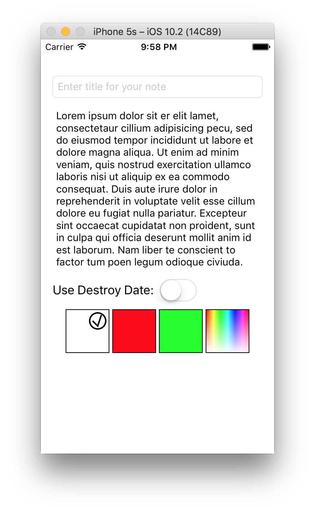
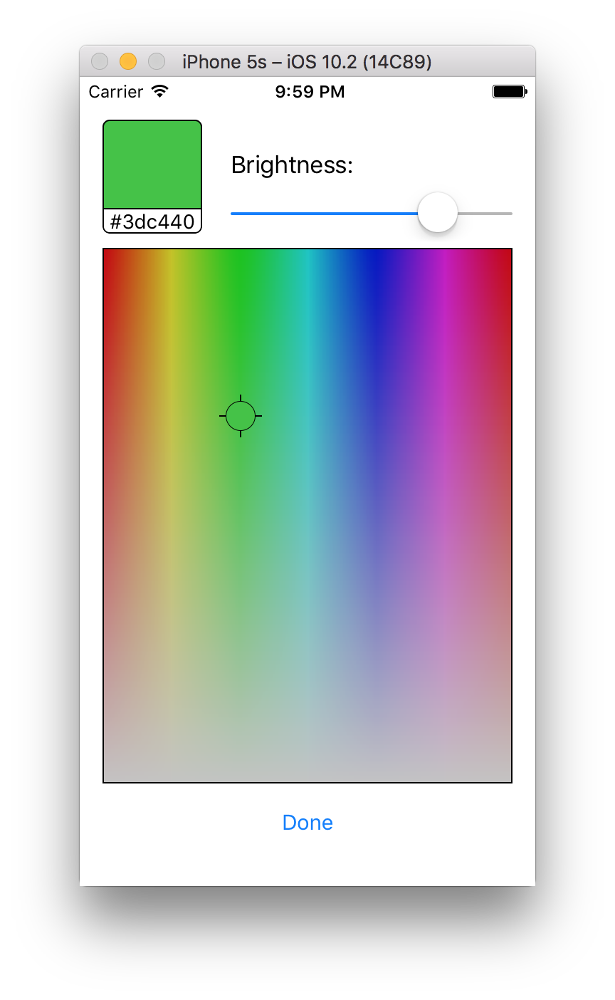

## Task #9 - Экран редактирования

Вам предстоит создать экран редактирования заметки. Для этого можете использовать Storyboard или создать отдельный xib-файл.

Пример экрана:

**Требования, которые необходимо реализовать:**

1. Все элементы адаптируются под любые размеры экрана. Для реализации используйте AutoLayout или учитывайте ширину при ручном расположении элементов. Вы можете проверить результат, поворачивая симулятор или устройство, а также в ассистенте в режиме Preview.
2. Интерфейс хорошо отображается на iPhone X. Помните про SafeArea. Проверьте результат на симуляторе iPhone X, обязательно поверните устройство.
3. Экран прокручивается, если содержимое не умещается по высоте. Проверить можно так: запустите приложение в симуляторе и начните редактировать любое поле ввода текста. Появившаяся клавиатура значительно ограничит доступную для отображения элементов высоту. Необходимый для реализации компонент в лекции мы не рассматривали, но в ней рассказали, где искать разные компоненты для разных задач. Вам нужно самостоятельно подобрать компонент и разобраться как с ним работать.
4. Высота поля для ввода текста заметки динамически меняется в зависимости от содержимого. У пустого поля задан минимальный размер.
5. Выбор цвета реализован в виде цветных квадратиков с чёрной рамкой. Текущий цвет помечается флажком. Флажок нарисуйте с помощью CoreGraphics.
6. В секции выбора цвета есть квадратик для выбора произвольного цвета и он удовлетворяет следующим требованиям:
	* Изначально выглядит как палитра цветов.
	* По долгому нажатию на квадратик открывается экран с представлением выбора цвета (компоненты ColorPicker-а). Пример окна смотрите ниже.
	* После выбора цвета в ColorPicker-е квадратик на первом экране окрашивается в выбранный цвет и помечается флажком.
7. Представление выбора цвета (ColorPicker) обязательно выполнено в виде самостоятельного компонента. То есть компонента, файлы которого (.swift и, возможно, .xib) можно перенести в другой проект и он заработает без изменений в коде компонента. В нём не должно быть зависимостей от других объектов в текущем проекте. Создайте для него отдельный класс-наследник `UIView`, как мы делали для `GameFieldView`. Компонент удовлетворяет следующим критериям:
	* Выбор цвета осуществляется путём перемещения пальца по палитре.
	* Элемент, указывающий на текущий цвет в палитре, залит в тот же цвет.
	* Элемент, отображающий текущий цвет (в левом верхнем углу), имеет скругление углов. Радиус выберите сами.
	* Выбранный цвет сохраняется при повторном заходе на экран ColorPicker.
8. При включении свитча Destroy Date должно появляться поле выбора даты — `UIDatePicker`, стандартный компонент. При выключении — пропадать.

Пример экрана с компонентом выбора цвета ColorPicker:

