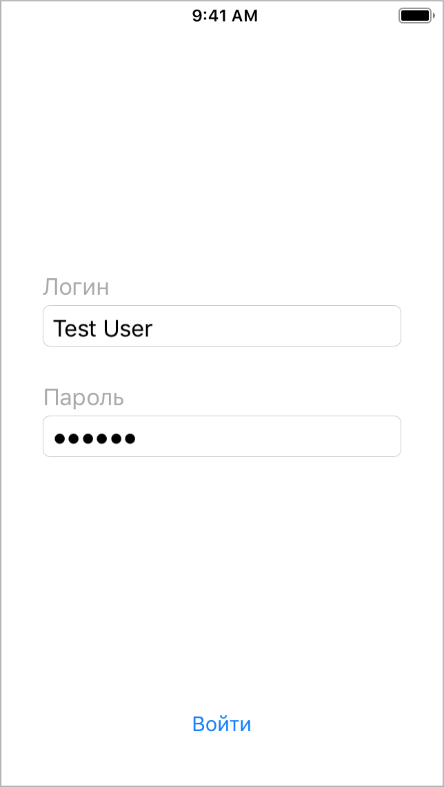
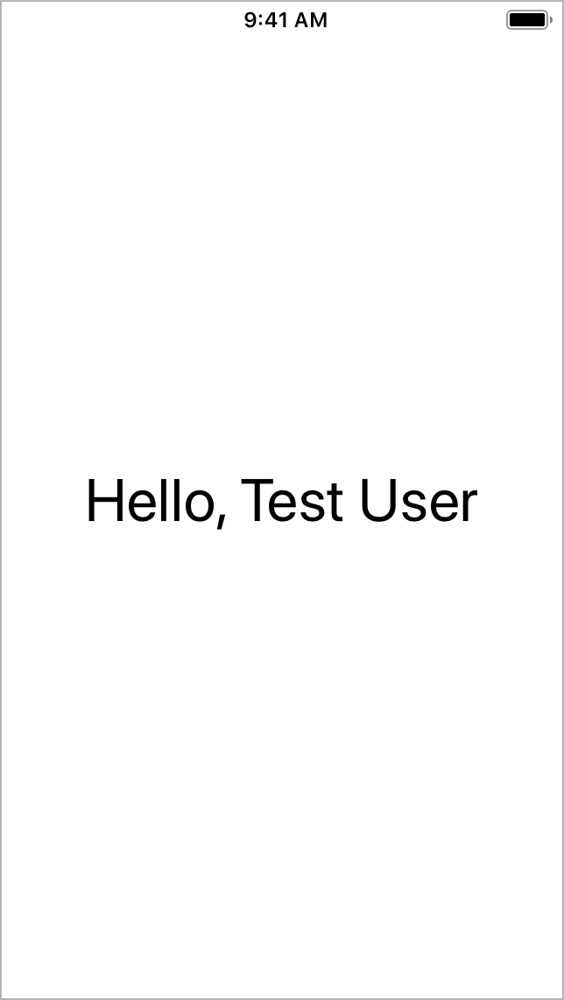

## Task #10.1 - Приложение "Приветствие"

Реализуйте два экрана:

1. На первом экране: текстовые поля для ввода логина и пароля, а так же кнопка «Войти».
2. Если пароль введен правильно (например 'Password'), покажите второй экран. На экране написано «Привет, <Имя из первого экрана>»

**Примеры экранов**

 

