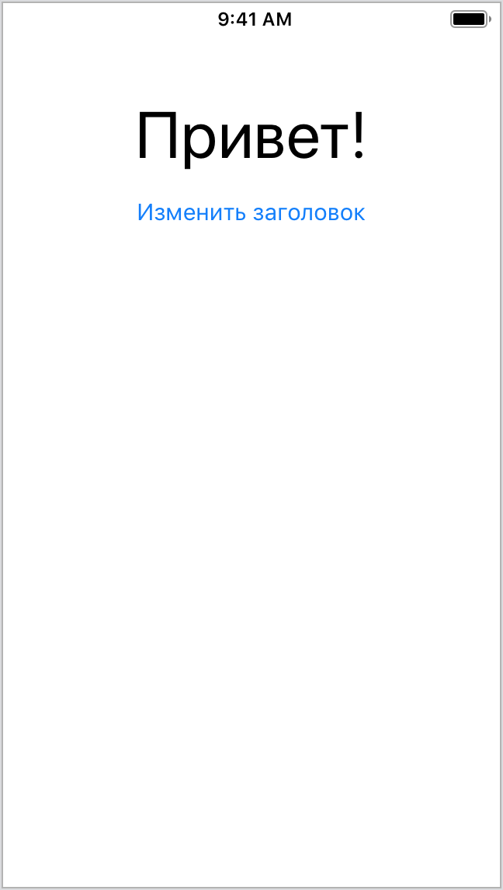
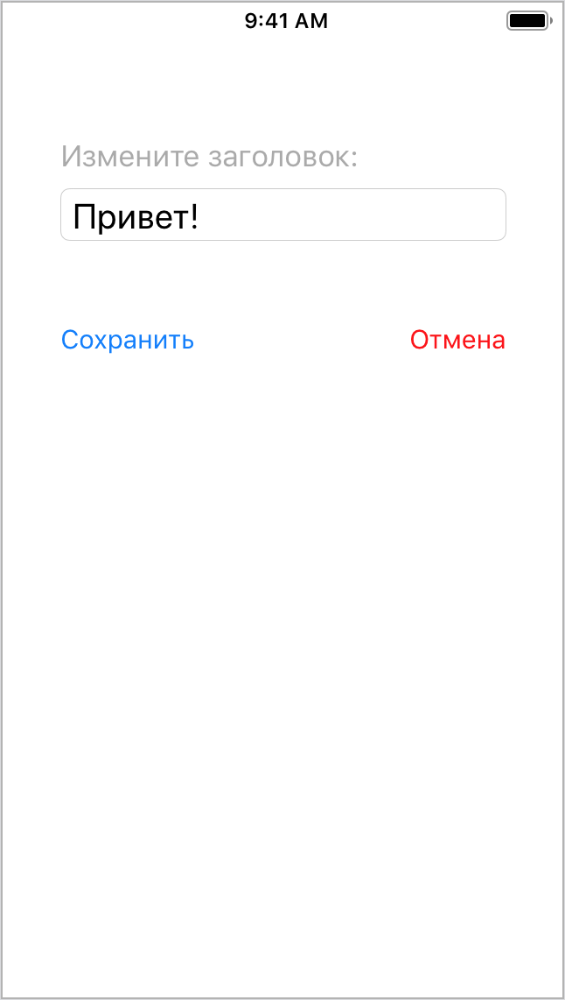

## Task #10.2 - Приложение "Приветствие"

Реализуйте два экрана:

1. В верхней части первого экрана находятся:
    * заголовок — текст с надписью «Привет»;
    * кнопка с названием «Изменить заголовок».
2. По нажатию на кнопку переходим на второй экран: видим текстовое поле, в котором написано то, что было в заголовке первого экрана.
3. Пользователь может отредактировать это поле и вернуться назад, нажав кнопку «Сохранить». После этого на первом экране заголовок должен измениться на тот, что указал пользователь.

**Примеры экранов**

 

