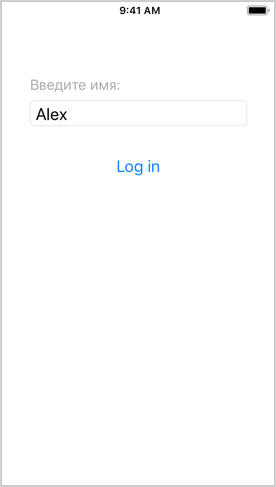
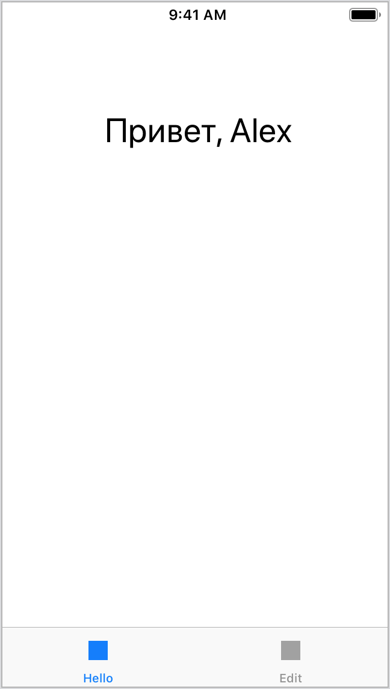
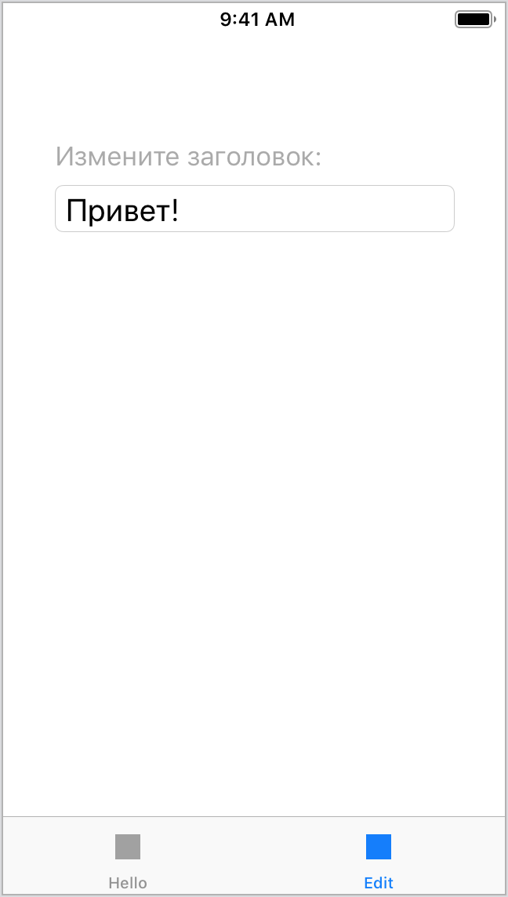

## Task #10.5 - Приложение "Приветствие"

[В проекте из предыдущего задания](hello-4.md) удалите все интерфейсные файлы (файлы с расширением .xib). Переделайте проект с использованием Storyboard так, чтобы его функциональность и внешний вид не изменились.

**Примеры экранов**

  

