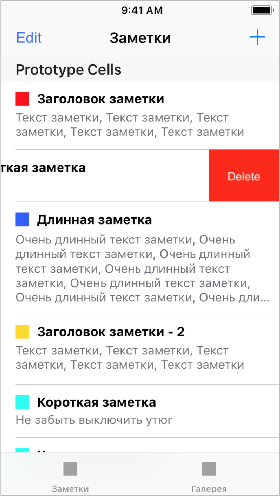
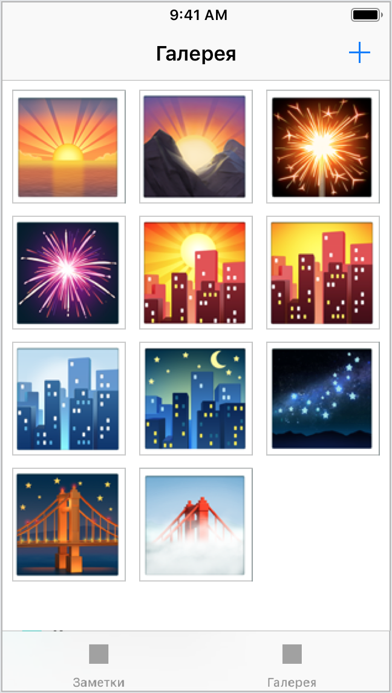
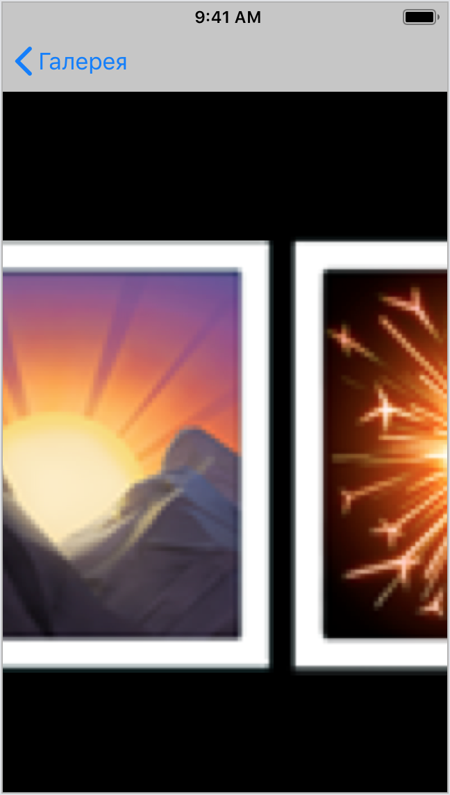

## Task #11 - Список заметок

Вам предстоит создать список заметок. В основе приложения разместите `UITabBarController` с двумя закладками.

**Требования:**

1. На первой закладке разместите `UINavigationController`. Первый экран в нём должен содержать таблицу (`UITableView`) со списком заметок. По нажатию на ячейку таблицы нужно переходить (Push) на экран редактирования заметки из [предыдущего задания](tasks/edit_screen.md).
2. На первой закладке разместите кнопку «+» в navigation bar. Если нажать на кнопку, будет создана новая заметка и пользователь сразу попадает на экран её редактирования.
3. После завершения редактирования пользователь закрывает экран и возвращается на список заметок. Созданная заметка должна добавиться на экран.
4. Для удаления заметки добавьте кнопку «Редактировать» или «Edit» слева от названия. Она должно переключать режим редактирования таблицы (`tableView.isEditing = true/false`). Удаление заметки из списка осуществляется свайпом влево или нажатием на «Delete» на нужной ячейке.
5. На второй закладке разместите галерею фото на `ScrollView`, созданную в [предыдущей задаче](hello-6.md). В галерее разместите минимум 5 фотографий.

**Усложняем 1:**

1. Сделайте высоту ячеек в таблице зависимой от контента так, чтобы вся заметка помещалась в ячейку таблицы, но не более пяти строк. В конце идёт троеточие.
2. Перенесите `ColorPicker`, созданный в [предыдущем задании](tasks/edit_screen.md), в отдельный `UIViewController` и покажите его при помощи метода Push.

**Усложняем 2:**

1. На второй закладке сделайте фото заметки. Разместите иконки фотографий с использованием `UICollectionView`.
2. По кнопке «+» позвольте пользователю добавлять фотографии через `UIImagePickerController`.
3. Тап по фото открывает (push) новый экран, в котором фото представлено в полный размер.
4. Свайпом вправо-влево можно пролистывать фото вперёд/назад по всем фотографиям.

 

